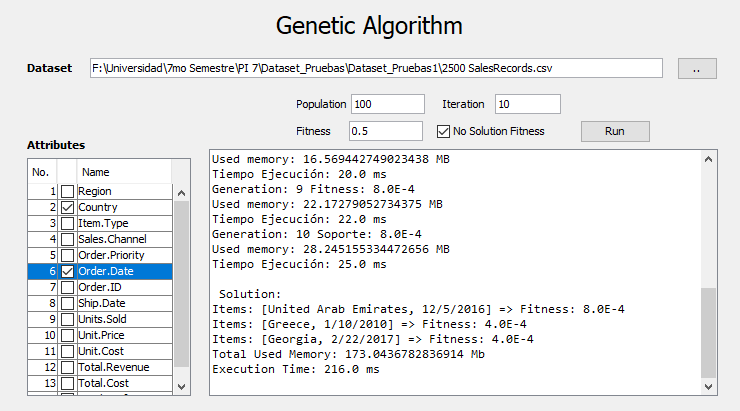

# Genetic Algorithm for Frequent ItemSets
A frequent pattern can be defined as a frequent subset, defined in the universe of all possible sets. Frequent patterns obtained during sequence mining are used in tasks of functional dependency detection, trend prediction, phenomena interpretation and as support decision making in production strategies. This project uses a genetic algorithm to implement new techniques that serve to find frequent patterns.

## Features
- Implementation of a binary type genetic algorithm.
- Reading .csv files.
- Insertion of the algorithm parameters through a view.
- Selection of attributes for the execution of the search.
- Assign a desired fitness, such as receiving the best individual.

## Installation
- Run\
Execution using .jar - <a href="https://github.com/dhernandezl/frequent_itemsets/releases" target="_blank">Download release</b></a>

## Get the source
Clone the Git repository from GitHub
```github
git clone https://github.com/dhernandezl/Frequent-Itemsets
```

## Result of experimentation
- Comparison of the algorithms of frequent patterns, applying the Wilcoxon and Friedman tests with Post-Hoc.

Table of Algorithm Comparisons.
Algorithm | Memory | Execution time| Fitness
------------ | :-------------: | :-------------: | :-------------:
Wilcoxon(GA vs Apriori)| 0.7212767 | 0.4065292663 | -
Wilcoxon(AprioriClosed vs Apriori)| 0.9593536 | 0.0050620321 | 0.005062032
Wilcoxon(AprioriClosed vs GA)| 0.7988593 | 0.0050620321 | 0.005062032
Friedman(GA vs Apriori)| 0.9728129 | 0.7804665633 | 1.000000000
Friedman(AprioriClosed vs Apriori)| 0.5028974 | 0.0006576615 | 0.002296452
Friedman(AprioriClosed vs GA)| 0.6438272 | 0.0071645092 | 0.002296452

**Result of application**



